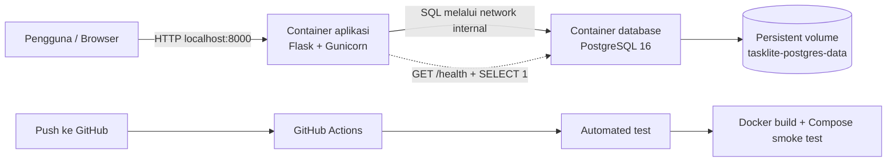

# TaskLite

TaskLite adalah aplikasi web CRUD sederhana untuk proyek UAS Cloud Computing. Aplikasi ini digunakan untuk mencatat tugas, mengubah detail dan status tugas, serta menghapus tugas yang sudah tidak diperlukan.

Fokus proyek bukan pada kompleksitas fitur, melainkan pada penerapan aplikasi multi-container secara lengkap dan ringan. Aplikasi dan database berjalan pada container yang berbeda, dikelola menggunakan Docker Compose, serta dilengkapi persistent volume, environment variable, health check, automated testing, dan pipeline GitHub Actions.

## Fitur Aplikasi

- Menampilkan seluruh tugas.
- Menambahkan tugas baru.
- Mengubah judul, catatan, dan status tugas.
- Menghapus tugas dengan konfirmasi.
- Validasi input pada browser dan server.
- Status tugas `Belum selesai` dan `Selesai`.
- Health endpoint yang memeriksa aplikasi dan koneksi database.
- Tampilan responsif tanpa framework frontend atau CDN.

## Arsitektur



Arsitektur lokal terdiri dari dua service:

1. `app`: aplikasi Flask yang dijalankan oleh Gunicorn pada port internal `8000`.
2. `db`: PostgreSQL 16 Alpine sebagai penyimpanan data.

Hanya port aplikasi yang dibuka ke Windows. PostgreSQL berada di network internal Docker Compose dan diakses aplikasi menggunakan hostname `db`.

## Teknologi

- Python 3.12
- Flask 3.1.3
- Flask-SQLAlchemy 3.1.1
- Psycopg 3.3.4
- Gunicorn 26.0.0
- PostgreSQL 16 Alpine
- Docker Desktop
- Docker Compose v2
- pytest 9.1.1
- GitHub Actions

## Struktur Proyek

```text
tasklite/
|-- .github/
|   `-- workflows/
|       `-- ci.yml
|-- app/
|   |-- static/
|   |   `-- style.css
|   |-- templates/
|   |   |-- base.html
|   |   |-- edit.html
|   |   `-- index.html
|   |-- __init__.py
|   |-- models.py
|   `-- routes.py
|-- tests/
|   |-- conftest.py
|   `-- test_tasks.py
|-- .dockerignore
|-- .env.example
|-- .gitignore
|-- compose.yaml
|-- Dockerfile
|-- requirements.txt
|-- requirements-dev.txt
|-- wsgi.py
`-- README.md
```

## Environment yang Dibutuhkan

Pada Windows 11, komponen yang dibutuhkan hanya:

| Komponen | Keterangan |
|---|---|
| Windows 11 64-bit | Sistem operasi host |
| Virtualization | Wajib aktif pada BIOS/UEFI |
| WSL 2 | Backend Linux untuk Docker Desktop |
| Docker Desktop | Menjalankan container dan Docker Compose |
| Git | Mengelola repository dan riwayat commit |
| Browser | Membuka aplikasi pada localhost |

Komponen berikut tidak perlu dipasang khusus untuk proyek ini:

- PostgreSQL lokal, karena database berjalan dalam container.
- Python lokal, karena Python dan dependency berada dalam image aplikasi.
- Node.js, PHP, Apache, dan MySQL Laragon.
- Kubernetes, Minikube, dan `kubectl`.
- VPS atau layanan cloud berbayar.

Laragon boleh tetap terpasang dan folder proyek boleh tetap berada di `C:\laragon\www`. Service Apache dan MySQL Laragon tidak digunakan oleh TaskLite dan boleh dihentikan untuk menghemat RAM.

## Tutorial Instalasi Windows 11

### 1. Periksa Virtualization

Buka Task Manager:

```text
Task Manager > Performance > CPU
```

Pastikan terdapat keterangan:

```text
Virtualization: Enabled
```

Jika masih `Disabled`, masuk ke BIOS/UEFI laptop dan aktifkan opsi virtualization. Nama opsinya biasanya salah satu dari:

- Intel Virtualization Technology atau Intel VT-x.
- AMD-V atau SVM Mode.

### 2. Install WSL 2

Buka PowerShell dengan pilihan **Run as administrator**, lalu jalankan:

```powershell
wsl --install
```

Perintah tersebut mengaktifkan komponen WSL dan Virtual Machine Platform, kemudian memasang Ubuntu sebagai distribusi Linux default. Panduan resminya tersedia pada [Microsoft Learn - Install WSL](https://learn.microsoft.com/en-us/windows/wsl/install).

Restart Windows setelah proses instalasi selesai.

Setelah restart, buka PowerShell dan jalankan:

```powershell
wsl --update
wsl --set-default-version 2
wsl --status
wsl --list --verbose
```

Pastikan distribusi menggunakan WSL versi 2:

```text
NAME      STATE     VERSION
Ubuntu    Stopped   2
```

Saat Ubuntu pertama kali dibuka, sistem mungkin meminta username dan password Linux. Nilainya bebas dan tidak harus sama dengan akun Windows.

Jika instalasi berhenti pada `0.0%`, gunakan:

```powershell
wsl --install --web-download -d Ubuntu
```

### 3. Install Docker Desktop

Unduh installer melalui [Docker Desktop for Windows](https://docs.docker.com/desktop/setup/install/windows-install/).

Saat instalasi:

1. Gunakan backend WSL 2.
2. Selesaikan instalasi dan restart atau logout jika diminta.
3. Buka Docker Desktop.
4. Tunggu sampai Docker Desktop berstatus running.

Buka pengaturan berikut:

```text
Settings > General
```

Aktifkan:

```text
Use the WSL 2 based engine
```

Kemudian buka:

```text
Settings > Resources > WSL Integration
```

Aktifkan integrasi untuk Ubuntu lalu pilih **Apply & Restart**. Referensi resminya tersedia pada [Docker Desktop WSL 2 integration](https://docs.docker.com/desktop/features/wsl/use-wsl/).

Kubernetes tidak perlu diaktifkan. Jika tersedia, Resource Saver dapat diaktifkan untuk mengurangi pemakaian resource ketika Docker sedang idle.

### 4. Install atau Periksa Git

Repository ini sudah menggunakan Git. Periksa instalasinya dengan:

```powershell
git --version
```

Jika belum tersedia, Git dapat dipasang dari [Git for Windows](https://git-scm.com/install/windows.html) atau melalui PowerShell:

```powershell
winget install --id Git.Git -e --source winget
```

### 5. Verifikasi Seluruh Environment

Tutup PowerShell lama, buka PowerShell baru, lalu jalankan:

```powershell
wsl --version
docker --version
docker compose version
git --version
```

Tes Docker Engine:

```powershell
docker run --rm hello-world
```

Jika muncul pesan `Hello from Docker!`, Docker sudah siap digunakan.

Perintah Compose yang digunakan adalah `docker compose`, bukan perintah lama `docker-compose`.

## Menyiapkan Konfigurasi Proyek

Masuk ke folder proyek:

```powershell
Set-Location C:\laragon\www\uas_pak_dhendra
```

Buat file `.env` apabila belum tersedia:

```powershell
if (-not (Test-Path .env)) {
    Copy-Item .env.example .env
}
```

Buka konfigurasi:

```powershell
notepad .env
```

Contoh isi file:

```dotenv
APP_PORT=8000
APP_ENV=development
POSTGRES_DB=tasklite
POSTGRES_USER=tasklite
POSTGRES_PASSWORD=ganti-password-lokal
```

Ganti `POSTGRES_PASSWORD` dengan password lokal. File `.env` sudah diabaikan oleh Git dan tidak boleh di-commit.

| Variable | Fungsi | Contoh |
|---|---|---|
| `APP_PORT` | Port aplikasi pada Windows | `8000` |
| `APP_ENV` | Nama environment aplikasi | `development` |
| `POSTGRES_DB` | Nama database PostgreSQL | `tasklite` |
| `POSTGRES_USER` | User PostgreSQL | `tasklite` |
| `POSTGRES_PASSWORD` | Password database | Ganti pada `.env` |

## Menjalankan Aplikasi

Pastikan Docker Desktop sudah running, lalu validasi Compose:

```powershell
docker compose config
```

Build dan jalankan aplikasi:

```powershell
docker compose up -d --build
```

Pada proses pertama, Docker akan otomatis:

1. Mengunduh image Python dan PostgreSQL.
2. Memasang dependency Flask.
3. Membuat image aplikasi TaskLite.
4. Membuat network internal.
5. Membuat persistent volume PostgreSQL.
6. Menjalankan database dan menunggu health check lulus.
7. Menjalankan aplikasi Flask melalui Gunicorn.

Periksa status container:

```powershell
docker compose ps
```

Buka aplikasi:

```powershell
Start-Process http://localhost:8000
```

Health endpoint dapat diperiksa dengan:

```powershell
Invoke-RestMethod http://localhost:8000/health
```

Respons sehat:

```json
{
  "database": "connected",
  "status": "healthy"
}
```

## Endpoint

| Method | Endpoint | Fungsi |
|---|---|---|
| `GET` | `/` | Menampilkan daftar dan form tambah tugas |
| `POST` | `/tasks` | Menambahkan tugas |
| `GET` | `/tasks/<id>/edit` | Menampilkan form edit |
| `POST` | `/tasks/<id>/update` | Memperbarui tugas |
| `POST` | `/tasks/<id>/delete` | Menghapus tugas |
| `GET` | `/health` | Memeriksa aplikasi dan koneksi database |

## Validasi Data

- Judul wajib berisi 3-100 karakter.
- Catatan maksimal 500 karakter.
- Status hanya boleh `pending` atau `done`.
- Data tidak valid mendapat respons HTTP 400 dan tidak disimpan.

## Automated Testing

Python dan pytest tidak perlu dipasang pada Windows. Tes dijalankan di dalam container aplikasi:

```powershell
docker compose run --rm app python -m pytest tests -q
```

Terdapat sembilan automated test yang mencakup:

- Empty state.
- Create.
- Validasi judul kosong.
- Validasi panjang catatan.
- Halaman edit.
- Update.
- Validasi status.
- Delete.
- Health check database.

Hasil yang diharapkan:

```text
.........                                                        [100%]
9 passed
```

## Persistent Volume

Data PostgreSQL disimpan pada named volume `tasklite-postgres-data`.

Untuk membuktikan persistensi:

1. Tambahkan tugas bernama `BUKTI-VOLUME-001` melalui browser.
2. Hentikan container:

```powershell
docker compose down
```

3. Jalankan kembali:

```powershell
docker compose up -d
```

4. Muat ulang halaman. Tugas tersebut harus tetap tersedia.

Perintah berikut menghapus container sekaligus seluruh data database lokal:

```powershell
docker compose down -v
```

Gunakan opsi `-v` hanya jika memang ingin mereset database.

## Simulasi Gangguan dan Recovery

Pastikan service berjalan:

```powershell
docker compose ps
curl.exe -i http://localhost:8000/health
```

Hentikan database:

```powershell
docker compose stop db
curl.exe -i http://localhost:8000/health
```

Health endpoint akan mengembalikan HTTP 503 karena database tidak tersedia.

Pulihkan database:

```powershell
docker compose start db
docker compose ps
curl.exe -i http://localhost:8000/health
```

Setelah PostgreSQL sehat, health endpoint kembali memberikan HTTP 200.

## Perintah Docker yang Sering Digunakan

```powershell
# Melihat status container
docker compose ps

# Mengikuti log aplikasi
docker compose logs -f app

# Mengikuti log database
docker compose logs -f db

# Masuk ke PostgreSQL
docker compose exec db psql -U tasklite -d tasklite

# Rebuild setelah source berubah
docker compose up -d --build

# Restart seluruh service
docker compose restart

# Menghentikan service tanpa menghapus data
docker compose down
```

## Pipeline CI/CD

Workflow `.github/workflows/ci.yml` berjalan otomatis pada push atau pull request menuju branch `main`.

Urutan pipeline:

1. Checkout source code.
2. Setup Python 3.12.
3. Install dependency.
4. Jalankan pytest sebagai quality gate.
5. Validasi Docker Compose.
6. Build Docker image.
7. Jalankan container aplikasi dan PostgreSQL.
8. Jalankan smoke test pada `/health`.
9. Bersihkan container dan volume runner CI.

Bukti pipeline:

- [Pipeline gagal saat bug validasi belum diperbaiki](https://github.com/naufaldenta/tasklite/actions/runs/29831220206).
- [Pipeline berhasil setelah validasi diperbaiki](https://github.com/naufaldenta/tasklite/actions/runs/29831388768).
- [Pipeline berhasil setelah redesign UI](https://github.com/naufaldenta/tasklite/actions/runs/29832772169).

## Strategi Commit

Setiap perubahan besar diuji, di-commit, dan langsung di-push. Format commit menggunakan prefix singkat, misalnya:

```text
feat: tambah fitur buat tugas
fix: benerin validasi judul kosong
refactor: rapihin config environment
test: tambah test fitur crud
ci: tambah workflow test dan build
docs: lengkapi readme project
```

Fitur Read, Create, Update, dan Delete memiliki checkpoint commit terpisah agar perkembangan proyek dapat dilihat dari riwayat repository.

## Troubleshooting

### Docker tidak dikenali

Pastikan Docker Desktop sedang running. Tutup PowerShell lama, buka PowerShell baru, kemudian jalankan:

```powershell
docker --version
docker compose version
```

### WSL bermasalah

```powershell
wsl --update
wsl --shutdown
```

Buka kembali Docker Desktop setelah WSL berhenti.

### Port 8000 sudah digunakan

Ubah `.env`:

```dotenv
APP_PORT=8080
```

Jalankan kembali:

```powershell
docker compose down
docker compose up -d
```

Buka `http://localhost:8080`.

### Database tidak sehat

```powershell
docker compose logs db
```

Periksa nilai `POSTGRES_DB`, `POSTGRES_USER`, dan `POSTGRES_PASSWORD` pada `.env`.

### Aplikasi tidak terhubung ke database

```powershell
docker compose logs app
```

Di dalam network Compose, hostname database adalah `db`, bukan `localhost`.

## Catatan Keamanan

- Jangan commit `.env`, password, token, private key, atau credential lainnya.
- PostgreSQL tidak mempublikasikan port ke Windows.
- Container aplikasi berjalan sebagai user non-root.
- Build context dibatasi menggunakan `.dockerignore`.
- GitHub Actions hanya memiliki permission `contents: read`.

## Pengembangan Lanjutan

Jika aplikasi dikembangkan menuju environment cloud:

- Push image aplikasi ke GitHub Container Registry atau Docker Hub.
- Jalankan image pada layanan container.
- Gunakan managed PostgreSQL.
- Simpan credential melalui secret manager.
- Tambahkan HTTPS, backup, logging, dan monitoring.
- Gunakan migration tool seperti Alembic ketika skema database berkembang.
