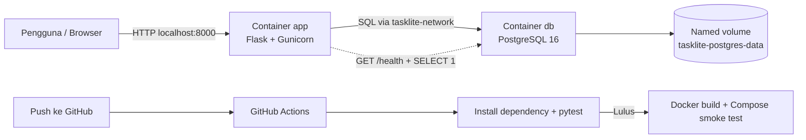

# TaskLite

TaskLite adalah aplikasi CRUD tugas sederhana untuk proyek UAS Cloud Computing. Aplikasinya sengaja kecil, tapi implementasi cloud-nya lengkap: dua container, Docker Compose, PostgreSQL, persistent volume, environment variable, health check, automated testing, dan GitHub Actions.

## Fitur

- Menampilkan daftar tugas.
- Menambah tugas baru.
- Mengubah judul, catatan, dan status tugas.
- Menghapus tugas dengan konfirmasi.
- Validasi input pada browser dan server.
- Health endpoint yang ikut mengecek koneksi database.
- Tampilan responsif tanpa framework frontend atau CDN.

## Arsitektur



Hanya port aplikasi yang dibuka ke Windows. PostgreSQL tetap berada di network internal Compose dan diakses aplikasi memakai hostname `db`.

## Teknologi

- Python 3.12
- Flask 3.1.3
- Flask-SQLAlchemy 3.1.1
- Psycopg 3.3.4
- Gunicorn 26.0.0
- PostgreSQL 16 Alpine
- Docker Desktop dan Docker Compose v2
- pytest 9.1.1
- GitHub Actions

## Struktur Proyek

```text
tasklite/
|-- .github/workflows/ci.yml
|-- app/
|   |-- static/style.css
|   |-- templates/
|   |   |-- base.html
|   |   |-- edit.html
|   |   `-- index.html
|   |-- __init__.py
|   |-- models.py
|   `-- routes.py
|-- tests/
|   |-- conftest.py
|   `-- test_tasks.py
|-- .dockerignore
|-- .env.example
|-- .gitignore
|-- compose.yaml
|-- Dockerfile
|-- requirements.txt
|-- requirements-dev.txt
|-- wsgi.py
`-- README.md
```

## Prasyarat Windows 11

Yang perlu dipasang di Windows hanya:

1. [WSL 2](https://learn.microsoft.com/en-us/windows/wsl/install)
2. [Docker Desktop](https://docs.docker.com/desktop/setup/install/windows-install/)
3. Git

Python dan PostgreSQL tidak wajib dipasang langsung di Windows karena sudah disediakan container.

Verifikasi environment:

```powershell
wsl --version
docker --version
docker compose version
git --version
```

Kubernetes tidak perlu diaktifkan.

## Menjalankan Aplikasi

Buka PowerShell di folder proyek:

```powershell
Set-Location C:\laragon\www\uas_pak_dhendra
Copy-Item .env.example .env
```

Ubah `POSTGRES_PASSWORD` dalam `.env`, lalu validasi dan jalankan service:

```powershell
docker compose config
docker compose build
docker compose up -d
docker compose ps
```

Buka aplikasi:

```powershell
Start-Process http://localhost:8000
```

Health endpoint tersedia di:

```text
http://localhost:8000/health
```

Respons sehat:

```json
{
  "database": "connected",
  "status": "healthy"
}
```

## Environment Variable

| Variable | Fungsi | Contoh lokal |
|---|---|---|
| `APP_PORT` | Port aplikasi pada Windows | `8000` |
| `APP_ENV` | Nama environment | `development` |
| `POSTGRES_DB` | Nama database | `tasklite` |
| `POSTGRES_USER` | User PostgreSQL | `tasklite` |
| `POSTGRES_PASSWORD` | Password PostgreSQL | Ganti pada `.env` |

File `.env` sudah masuk `.gitignore` dan tidak boleh di-commit. Repository hanya menyimpan `.env.example` dengan placeholder.

## Endpoint

| Method | Endpoint | Fungsi |
|---|---|---|
| `GET` | `/` | Daftar tugas dan form tambah |
| `POST` | `/tasks` | Menambah tugas |
| `GET` | `/tasks/<id>/edit` | Form edit tugas |
| `POST` | `/tasks/<id>/update` | Memperbarui tugas |
| `POST` | `/tasks/<id>/delete` | Menghapus tugas |
| `GET` | `/health` | Status aplikasi dan database |

## Validasi

- Judul wajib diisi 3-100 karakter.
- Catatan maksimal 500 karakter.
- Status hanya boleh `pending` atau `done`.
- Data invalid mendapat HTTP 400 dan tidak disimpan.

## Automated Testing

Image aplikasi sudah memuat dependency test supaya pengujian dapat dijalankan tanpa memasang Python di Windows:

```powershell
docker compose run --rm app python -m pytest tests -q
```

Saat ini terdapat sembilan test otomatis untuk:

- Empty state daftar tugas.
- Create.
- Validasi judul kosong.
- Validasi panjang catatan.
- Halaman edit.
- Update.
- Validasi status.
- Delete.
- Health check database.

## Bukti Persistent Volume

1. Jalankan aplikasi dan tambah task bernama `BUKTI-VOLUME-001`.
2. Turunkan container tanpa menghapus volume:

```powershell
docker compose down
```

3. Jalankan kembali:

```powershell
docker compose up -d
docker compose ps
```

4. Muat ulang browser. Task `BUKTI-VOLUME-001` harus tetap tersedia.

> Jangan memakai `docker compose down -v` untuk demo ini. Opsi `-v` menghapus named volume beserta data PostgreSQL.

## Simulasi Gangguan dan Recovery

Pastikan kedua service sehat:

```powershell
docker compose ps
curl.exe -i http://localhost:8000/health
```

Hentikan database:

```powershell
docker compose stop db
curl.exe -i http://localhost:8000/health
docker compose ps
```

App tetap hidup, tetapi `/health` akan memberi HTTP 503 karena database tidak tersedia.

Pulihkan database:

```powershell
docker compose start db
docker compose ps
curl.exe -i http://localhost:8000/health
```

Setelah PostgreSQL sehat, `/health` kembali HTTP 200. Konfigurasi `pool_pre_ping` membantu aplikasi memeriksa ulang koneksi database yang sudah lama.

## Perintah Berguna

```powershell
# Lihat status
docker compose ps

# Ikuti log aplikasi
docker compose logs -f app

# Lihat log database
docker compose logs db

# Masuk ke PostgreSQL
docker compose exec db psql -U tasklite -d tasklite

# Rebuild setelah source berubah
docker compose up -d --build

# Hentikan service tanpa menghapus data
docker compose down
```

Reset database hanya jika benar-benar disengaja:

```powershell
docker compose down -v
```

Perintah tersebut menghapus data volume proyek.

## Pipeline CI/CD

Workflow berada di `.github/workflows/ci.yml` dan berjalan pada push atau pull request ke `main`.

Urutan pipeline:

1. Checkout source code.
2. Setup Python 3.12.
3. Install dependency.
4. Jalankan automated test.
5. Salin environment khusus CI.
6. Validasi Docker Compose.
7. Build Docker image.
8. Jalankan container app dan PostgreSQL.
9. Smoke test `/health`.
10. Cleanup container dan volume runner CI.

Automated test dijalankan sebelum Docker build sehingga berfungsi sebagai quality gate.

### Bukti run gagal dan berhasil

- [Pipeline gagal terkontrol](https://github.com/naufaldenta/tasklite/actions/runs/29831220206) - test membuktikan judul kosong masih diterima server.
- [Pipeline berhasil setelah perbaikan](https://github.com/naufaldenta/tasklite/actions/runs/29831388768) - validasi server diterapkan dan seluruh pipeline lulus.

Run gagal tidak dihapus supaya proses menemukan bug, menganalisis, dan memperbaikinya dapat diverifikasi.

## Strategi Commit

Setiap perubahan besar diuji, di-commit, lalu langsung di-push. Contoh format:

```text
feat: tambah fitur buat tugas
fix: benerin validasi judul kosong
refactor: rapihin config environment
test: tambah test fitur crud
ci: tambah workflow test dan build
docs: lengkapi readme project
```

Operasi Read, Create, Update, dan Delete memiliki checkpoint commit terpisah agar perkembangan pengerjaan terlihat jelas.

## Troubleshooting

### Port 8000 sudah dipakai

Ubah `.env`:

```dotenv
APP_PORT=8080
```

Kemudian jalankan:

```powershell
docker compose up -d
```

Buka `http://localhost:8080`.

### Database tidak sehat

```powershell
docker compose logs db
```

Periksa nilai `POSTGRES_DB`, `POSTGRES_USER`, dan `POSTGRES_PASSWORD` pada `.env`.

### App tidak terhubung ke database

```powershell
docker compose logs app
```

Di dalam network Compose, host database adalah `db`, bukan `localhost`.

### Docker Desktop bermasalah

```powershell
wsl --status
wsl --update
wsl --shutdown
```

Buka kembali Docker Desktop setelah WSL dihentikan.

## Pengembangan ke Cloud

Jika TaskLite dipindahkan dari localhost menuju cloud:

- Push image aplikasi ke GitHub Container Registry atau Docker Hub.
- Jalankan image pada layanan container/cloud platform.
- Ganti container PostgreSQL dengan managed PostgreSQL.
- Simpan credential pada secret manager.
- Tambahkan HTTPS, backup terjadwal, logging, monitoring, dan autoscaling.
- Gunakan migration tool seperti Alembic ketika schema mulai berkembang.

## Catatan Keamanan

- Jangan commit `.env`, password, token, private key, atau credential lain.
- Database tidak mempublikasikan port ke host.
- Container aplikasi berjalan sebagai user non-root.
- Image memakai `.dockerignore` dan dependency dipasang dari file versi terkunci.
- GitHub Actions hanya memperoleh permission `contents: read`.
