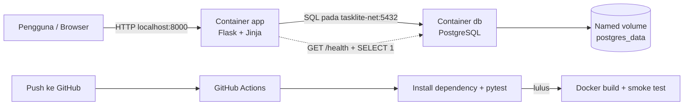

# Rencana Proyek UAS Cloud Computing

## 1. Ringkasan Keputusan

Nama aplikasi yang disarankan: **TaskLite - Sistem Manajemen Tugas Sederhana**.

TaskLite adalah aplikasi web satu halaman untuk mencatat tugas. Pengguna dapat melihat, menambah, mengubah, menandai status, dan menghapus tugas. Aplikasi sengaja sederhana karena fokus UAS adalah bukti penerapan Cloud Computing, bukan banyaknya fitur.

Stack minimum:

- Aplikasi: Python 3.12, Flask, Flask-SQLAlchemy, HTML/Jinja, dan CSS lokal.
- Database: PostgreSQL 16 Alpine.
- Orkestrasi: Docker Compose v2.
- Testing: pytest dan Flask test client.
- CI/CD: GitHub Actions.
- Container inti: tepat dua, yaitu `app` dan `db`.
- Tidak memakai Kubernetes, VPS, frontend JavaScript terpisah, Redis, Nginx, atau Adminer pada versi inti.

Kubernetes tidak perlu dipasang. Pada proyek ini, istilah orkestrasi dipenuhi oleh Docker Compose yang mengelola service, network, volume, urutan startup, health check, dan restart policy secara deklaratif.

## 2. Pemetaan Ketentuan UAS

| Ketentuan | Implementasi pada TaskLite | Bukti yang disiapkan |
|---|---|---|
| Menampilkan data | Halaman utama menampilkan semua tugas | Screenshot daftar dan demo browser |
| Menambah data | Form tambah tugas | Task baru tampil dan tersimpan di PostgreSQL |
| Mengubah data | Form edit judul, deskripsi, dan status | Data berubah setelah submit |
| Menghapus data | Tombol hapus dengan konfirmasi sederhana | Data hilang dari daftar |
| Validasi input | Judul wajib 3-100 karakter; status hanya `pending` atau `done` | Test validasi dan pesan error |
| Koneksi database | Flask-SQLAlchemy memakai host Compose `db` | Log app, CRUD berhasil, dan `/health` |
| Dockerfile/image | Image app berbasis `python:3.12-slim` | `docker compose build` dan `docker images` |
| Multi-container | Service `app` dan `db` | `docker compose ps` menampilkan dua container |
| Port | Aplikasi dipublikasikan pada `${APP_PORT}:8000` | Browser membuka `localhost:8000` |
| Network | Network eksplisit `tasklite-net` | `docker network inspect` |
| `depends_on` | App menunggu DB berstatus sehat | Konfigurasi Compose dan urutan startup |
| Restart policy | `restart: unless-stopped` pada kedua service | Isi Compose dan simulasi yang dijelaskan |
| Persistent volume | Named volume `postgres_data` | Data tetap ada setelah `down` lalu `up -d` |
| Environment variable | `.env`, `.env.example`, dan `env_file` | File contoh tersedia; `.env` diabaikan Git |
| Health check | DB memakai `pg_isready`; app memakai `/health` | Status `(healthy)`, respons 200/503 |
| Automated testing | Minimal lima test endpoint/validasi/CRUD | `pytest -q` lulus |
| GitHub Actions | Checkout, install dependency, test, validasi Compose, Docker build, smoke test | Link run gagal dan run berhasil |
| Riwayat commit | Commit kecil berdasarkan tahapan | Halaman commit GitHub |

Catatan penting: bagian komponen UAS menulis CI/CD 10 poin, sedangkan tabel rubrik final memberi 15%. Rencana ini mengikuti tuntutan yang lebih ketat pada tabel rubrik.

## 3. Arsitektur



Alur utama:

1. Browser hanya mengakses container `app` melalui port host.
2. `app` berkomunikasi dengan `db` memakai nama service `db`, bukan `localhost`.
3. PostgreSQL menyimpan data pada named volume agar tidak hilang saat container dibuat ulang.
4. Database tidak perlu mempublikasikan port 5432 ke Windows; port hanya tersedia di network internal Compose.
5. Test menjadi quality gate. Docker image hanya dibangun apabila test lulus.

## 4. Ruang Lingkup CRUD

### Halaman dan endpoint

| Method | Path | Fungsi |
|---|---|---|
| `GET` | `/` | Menampilkan daftar dan form tambah tugas |
| `POST` | `/tasks` | Memvalidasi dan menambah tugas |
| `GET` | `/tasks/<id>/edit` | Menampilkan form edit |
| `POST` | `/tasks/<id>/update` | Memvalidasi dan memperbarui tugas |
| `POST` | `/tasks/<id>/delete` | Menghapus tugas |
| `GET` | `/health` | Menguji proses app dan koneksi database |

Tidak diperlukan login, upload file, pagination, REST frontend terpisah, atau role pengguna. Semua itu menambah risiko tanpa menambah nilai wajib.

### Skema tabel `tasks`

| Kolom | Tipe | Aturan |
|---|---|---|
| `id` | integer | Primary key, auto increment |
| `title` | varchar(100) | Wajib, panjang 3-100 karakter |
| `description` | text | Opsional, maksimal 500 karakter pada validasi aplikasi |
| `status` | varchar(20) | Hanya `pending` atau `done` |
| `created_at` | timestamp | Otomatis ketika dibuat |
| `updated_at` | timestamp | Otomatis diperbarui |

Untuk versi UAS, tabel dapat dibuat melalui `db.create_all()` saat startup. Migrasi Alembic/Flask-Migrate dicatat sebagai pengembangan masa depan, bukan dependency wajib.

## 5. Desain Container dan Konfigurasi

### Service `app`

- Build dari `Dockerfile` lokal.
- Base image `python:3.12-slim`.
- `WORKDIR /app`.
- Menyalin dan memasang `requirements.txt` sebelum source code agar layer dependency dapat di-cache.
- Menjalankan Gunicorn pada `0.0.0.0:8000`.
- Port host ditentukan oleh `APP_PORT` dalam `.env`.
- Health check memanggil `http://localhost:8000/health` memakai Python standard library, sehingga tidak perlu memasang `curl`.
- Restart policy `unless-stopped`.

### Service `db`

- Image `postgres:16-alpine`.
- Credential dan nama database dibaca dari `.env`.
- Data disimpan pada `postgres_data:/var/lib/postgresql/data`.
- Health check memakai `pg_isready`.
- Hanya berada pada network internal; tidak perlu port host.
- Restart policy `unless-stopped`.

### Compose

- Nama file: `compose.yaml`.
- Network eksplisit: `tasklite-net`.
- Named volume: `postgres_data`.
- `app.depends_on.db.condition: service_healthy` agar app tidak mulai sebelum PostgreSQL siap. Dokumentasi Docker menjelaskan bahwa status “running” saja belum berarti service siap menerima koneksi.

### Environment variable

Isi minimum `.env.example`:

```dotenv
APP_PORT=8000
APP_ENV=development
POSTGRES_DB=tasklite
POSTGRES_USER=tasklite
POSTGRES_PASSWORD=ganti-password-lokal
DB_HOST=db
DB_PORT=5432
```

Aturan keamanan:

- Salin `.env.example` menjadi `.env` dan ganti password lokal.
- Masukkan `.env` ke `.gitignore` sebelum commit pertama.
- `.env.example` hanya berisi placeholder, bukan credential pribadi.
- Jangan commit token GitHub, password Docker Hub, private key, atau file credential.
- Untuk CI, gunakan nilai dummy khusus runner atau GitHub Secrets apabila kelak melakukan publish image.

## 6. Struktur Direktori yang Akan Dibuat

```text
uas_pak_dhendra/
|-- .github/
|   `-- workflows/
|       `-- ci.yml
|-- app/
|   |-- __init__.py
|   |-- templates/
|   |   |-- index.html
|   |   `-- edit.html
|   `-- static/
|       `-- style.css
|-- tests/
|   |-- conftest.py
|   `-- test_app.py
|-- .dockerignore
|-- .env.example
|-- .gitignore
|-- compose.yaml
|-- Dockerfile
|-- requirements.txt
|-- README.md
`-- RENCANA_PROYEK_UAS.md
```

`app/__init__.py` akan memuat application factory, model `Task`, route CRUD, validasi, dan route health. Memusatkan logika kecil dalam satu modul menjaga proyek tetap mudah dijelaskan tanpa mengorbankan kemampuan testing.

## 7. Tutorial Environment Windows 11 dari Nol

### 7.1 Periksa prasyarat

1. Tekan `Win + R`, jalankan `winver`, dan pastikan Windows 11 sudah memperoleh update yang masih didukung.
2. Buka Task Manager > Performance > CPU dan periksa `Virtualization: Enabled`.
3. Jika masih `Disabled`, aktifkan Intel VT-x/AMD-V/SVM melalui BIOS/UEFI. Nama menunya berbeda pada setiap merek laptop.
4. Docker mencantumkan 8 GB RAM sebagai prasyarat Docker Desktop dengan backend WSL 2. TaskLite sendiri dibuat hanya dengan dua service agar beban tambahannya rendah.

### 7.2 Pasang dan perbarui WSL 2

Buka PowerShell dengan **Run as administrator**, lalu jalankan:

```powershell
wsl --install
```

Restart Windows apabila diminta. Setelah masuk kembali, jalankan:

```powershell
wsl --update
wsl --version
wsl -l -v
```

Distribusi baru dari `wsl --install` memakai WSL 2 secara default. Jika kolom VERSION untuk Ubuntu masih `1`, ubah dengan:

```powershell
wsl --set-version Ubuntu 2
```

Panduan resmi: [Install WSL - Microsoft Learn](https://learn.microsoft.com/en-us/windows/wsl/install).

### 7.3 Pasang Docker Desktop

1. Unduh installer dari [Docker Desktop for Windows](https://docs.docker.com/desktop/setup/install/windows-install/).
2. Pilih instalasi **per-user** dan backend **WSL 2**. Mode ini direkomendasikan Docker untuk mayoritas pengguna.
3. Jalankan Docker Desktop dari Start Menu.
4. Pada Settings > General, pastikan `Use the WSL 2 based engine` aktif apabila opsinya terlihat.
5. Pastikan mode yang dipakai adalah Linux containers.
6. Jangan mengaktifkan Kubernetes; proyek ini tidak membutuhkannya.
7. Tunggu sampai status Docker Engine menyatakan berjalan.

Verifikasi dari PowerShell biasa:

```powershell
docker --version
docker compose version
docker info
docker run --rm hello-world
```

Gunakan perintah modern `docker compose` dengan spasi, bukan binary lama `docker-compose`.

### 7.4 Pasang Git

Jika `git --version` belum bekerja, pasang Git for Windows melalui [git-scm.com](https://git-scm.com/download/win) atau Windows Package Manager:

```powershell
winget install --id Git.Git -e --source winget
```

Tutup dan buka kembali PowerShell, kemudian:

```powershell
git --version
git config --global user.name "Nama Mahasiswa"
git config --global user.email "email-yang-dipakai-di-github@example.com"
```

Python dan PostgreSQL tidak perlu dipasang langsung di Windows. Keduanya akan tersedia di dalam container.

### 7.5 Menjalankan proyek setelah kode selesai

Dari PowerShell:

```powershell
Set-Location C:\laragon\www\uas_pak_dhendra
Copy-Item .env.example .env
docker compose config
docker compose build
docker compose up -d
docker compose ps
Start-Process http://localhost:8000
```

Perintah harian:

```powershell
docker compose logs -f app
docker compose run --rm app pytest -q
docker compose restart app
docker compose down
```

`docker compose down` tidak menghapus named volume. Jangan menambahkan `-v` pada demo persistensi karena `docker compose down -v` memang menghapus volume dan data database.

### 7.6 Troubleshooting minimum

| Gejala | Pemeriksaan dan solusi |
|---|---|
| Docker Desktop tidak mulai | Jalankan `wsl --status`, `wsl --update`, lalu `wsl --shutdown`; buka kembali Docker Desktop |
| WSL meminta virtualisasi | Aktifkan VT-x/AMD-V/SVM di BIOS/UEFI |
| Port 8000 dipakai aplikasi lain | Ubah `APP_PORT=8080` dalam `.env`, lalu `docker compose up -d` dan buka `localhost:8080` |
| Container DB tidak sehat | Jalankan `docker compose logs db` dan periksa variabel POSTGRES dalam `.env` |
| App tidak dapat terhubung ke DB | Pastikan `DB_HOST=db`, bukan `localhost`, lalu lihat `docker compose logs app` |
| Perubahan Compose tidak diterapkan | Jalankan `docker compose config`, lalu `docker compose up -d --build` |
| Ingin reset database | Hanya jika benar-benar disengaja: `docker compose down -v`; tindakan ini menghapus data volume proyek |

## 8. Rencana Automated Testing

Minimal lima test akan dibuat agar melampaui syarat tiga test:

| Test | Tujuan | Hasil yang diharapkan |
|---|---|---|
| `test_health_returns_200` | Memastikan app sehat pada database test | HTTP 200 dan JSON `healthy` |
| `test_list_tasks` | Memastikan halaman utama dapat dibuka | HTTP 200 dan data tampil |
| `test_create_task` | Menguji tambah data valid | Task tersimpan dan tampil |
| `test_reject_blank_title` | Menguji validasi judul | Input ditolak dan tidak tersimpan |
| `test_update_task` | Menguji ubah judul/status | Nilai baru tersimpan |
| `test_delete_task` | Menguji hapus data | Record tidak ditemukan lagi |

Test cepat memakai SQLite in-memory melalui konfigurasi test. Hal ini membuat quality gate berjalan cepat tanpa service eksternal. Setelah image dibangun, smoke test Compose memanggil `/health` terhadap app yang benar-benar terhubung ke PostgreSQL sehingga integrasi produksi tetap terbukti.

Menjalankan test tanpa memasang Python di Windows:

```powershell
docker compose build app
docker compose run --rm app pytest -q
```

## 9. Rencana Pipeline GitHub Actions

File workflow: `.github/workflows/ci.yml`. Workflow dijalankan pada `push` dan `pull_request` ke `main`.

Urutan job:

1. Checkout source code.
2. Setup Python 3.12.
3. Cache pip secara opsional.
4. Install dependency dari `requirements.txt`.
5. Jalankan `pytest -q` dengan database SQLite in-memory.
6. Validasi konfigurasi menggunakan `docker compose config`.
7. Build image aplikasi.
8. Jalankan Compose dengan credential dummy CI.
9. Tunggu container sehat dan panggil `/health` sebagai smoke test.
10. Jalankan `docker compose down -v` pada tahap cleanup runner CI saja.

Konsep workflow mengikuti dokumentasi resmi bahwa workflow GitHub Actions adalah proses otomatis berbasis YAML di `.github/workflows`. Referensi: [GitHub Actions workflows](https://docs.github.com/en/actions/concepts/workflows-and-actions/workflows) dan [Continuous integration](https://docs.github.com/en/actions/get-started/continuous-integration).

### Bukti pipeline gagal dan berhasil

Gunakan kegagalan yang relevan dan terkontrol, bukan sengaja membocorkan secret atau merusak repository:

1. Pastikan workflow dan beberapa test dasar sudah berhasil.
2. Commit test baru `test_reject_blank_title` sebelum validasi judul diterapkan.
3. Push commit; test gagal karena judul kosong masih diterima.
4. Simpan URL run gagal dan screenshot/log assertion.
5. Implementasikan validasi judul.
6. Commit perbaikan dan push.
7. Simpan URL run berhasil.
8. Jangan force-push, squash, menghapus run gagal, atau mengubah test agar sekadar hijau.

Dengan cara ini, riwayat Git menunjukkan praktik TDD: test mengungkap bug, lalu implementasi diperbaiki.

## 10. Rencana Simulasi Persistensi dan Ketahanan

### Persistensi data

1. Tambahkan tugas unik, misalnya `BUKTI-VOLUME-001`.
2. Ambil screenshot data di browser.
3. Jalankan `docker compose down` tanpa `-v`.
4. Jalankan `docker compose up -d`.
5. Tunggu `docker compose ps` menunjukkan sehat.
6. Muat ulang browser dan tunjukkan `BUKTI-VOLUME-001` masih tersedia.

### Gangguan database dan pemulihan

1. Pastikan app dan DB sehat.
2. Jalankan `docker compose stop db`.
3. Buka `/health`; app harus memberi HTTP 503 karena query `SELECT 1` gagal.
4. Jalankan `docker compose ps` dan simpan bukti perubahan status.
5. Jalankan `docker compose start db`.
6. Tunggu health check DB lulus.
7. Buka kembali `/health`; respons kembali HTTP 200 tanpa kehilangan data.

Simulasi ini membuktikan dampak kegagalan service, fungsi health check, strategi recovery, dan manfaat volume secara bersamaan.

## 11. Strategi Commit

Jangan membuat seluruh proyek dalam satu commit. Riwayat yang disarankan:

1. `docs: add UAS requirements and implementation plan`
2. `chore: initialize Flask project structure`
3. `feat: add task list and create operation`
4. `feat: add update and delete operations`
5. `chore: add application Dockerfile`
6. `chore: add PostgreSQL compose service and persistent volume`
7. `feat: add application and database health checks`
8. `test: add baseline endpoint and CRUD tests`
9. `ci: add test and Docker build workflow`
10. `test: expose missing blank-title validation` - run ini sengaja gagal.
11. `fix: reject blank task titles` - run berikutnya harus berhasil.
12. `docs: add demo evidence and final README`

Setelah repository GitHub kosong dibuat melalui antarmuka GitHub:

```powershell
git init
git branch -M main
git add .
git commit -m "docs: add UAS requirements and implementation plan"
git remote add origin https://github.com/USERNAME/tasklite-cloud-uas.git
git push -u origin main
```

Sebelum `git add .`, pastikan `.gitignore` sudah memuat `.env` dan jalankan `git status` untuk memastikan credential tidak ikut staged.

## 12. Tahapan Pengerjaan

| Fase | Hasil akhir | Kriteria selesai |
|---|---|---|
| 1. Environment | WSL 2, Docker Desktop, Compose, Git | Semua perintah versi dan `hello-world` berhasil |
| 2. Skeleton aplikasi | Flask, template, model, DB config | Halaman dapat dibuka dan schema terbentuk |
| 3. CRUD | List/create/update/delete + validasi | Semua operasi berjalan melalui browser |
| 4. Container | Dockerfile dan Compose dua service | Kedua container sehat dan app terhubung DB |
| 5. Testing | Minimal lima automated test | `pytest -q` lulus lokal |
| 6. CI/CD | Workflow test, build, smoke test | Satu run gagal terkontrol dan satu run lulus |
| 7. Reliability | Persistensi dan simulasi gangguan | Bukti data tetap ada dan health pulih |
| 8. Dokumentasi | README, diagram, laporan, slide, video | Semua link dan bukti sesuai format UAS |

Urutan ini harus dipertahankan. Nilai tambahan seperti registry baru dipertimbangkan setelah seluruh bukti wajib selesai.

## 13. Bukti yang Perlu Dikumpulkan

Simpan screenshot/log secara berurutan:

1. `docker --version` dan `docker compose version`.
2. `docker compose build` berhasil.
3. `docker compose up -d` dan `docker compose ps` dengan dua service sehat.
4. Halaman daftar tugas.
5. Tambah, edit, dan hapus data.
6. Validasi input kosong.
7. `docker volume ls` dan hasil persistensi setelah `down`/`up`.
8. `/health` dalam kondisi sehat.
9. Kondisi DB berhenti, app tidak sehat/HTTP 503, lalu pulih ke 200.
10. `pytest -q` lokal dengan minimal lima test lulus.
11. GitHub Actions run gagal beserta baris error.
12. Commit perbaikan dan GitHub Actions run berhasil.
13. Halaman riwayat commit GitHub.
14. Diagram arsitektur.

## 14. Rencana Laporan, Slide, dan Video

### Laporan PDF 10-15 halaman

Target aman: sekitar 12-13 halaman, tidak termasuk lampiran jika aturan dosen mengizinkan.

- Bab 1 Pendahuluan: latar belakang, masalah, tujuan, manfaat.
- Bab 2 Analisis dan Arsitektur: TaskLite, pengguna, stack, diagram, hubungan seluruh komponen.
- Bab 3 Implementasi Aplikasi: CRUD, validasi, struktur folder, tabel database, environment.
- Bab 4 Implementasi Container: Dockerfile, image, Compose, network, volume, health check.
- Bab 5 Implementasi CI/CD: test sebagai quality gate, workflow, run gagal, analisis, fix, run berhasil.
- Bab 6 Pengujian: CRUD, test otomatis, persistensi, gangguan DB, recovery, hasil.
- Bab 7 Kesimpulan: capaian, kendala, solusi, dan migrasi cloud.

### Presentasi maksimal 8 slide

1. Identitas dan judul.
2. Masalah, tujuan, dan fitur TaskLite.
3. Diagram arsitektur dan fungsi container.
4. CRUD, validasi, dan database.
5. Dockerfile, Compose, network, volume, dan env.
6. Health check, persistensi, dan simulasi gangguan.
7. Automated test dan pipeline gagal-berhasil.
8. Hasil, kesimpulan, dan rencana cloud.

### Video 7-10 menit

- 0:00-0:30 - identitas dan judul.
- 0:30-1:20 - struktur repository dan diagram.
- 1:20-2:00 - versi Docker/Compose, build, `up -d`, dan `ps`.
- 2:00-3:30 - demo CRUD dan validasi.
- 3:30-4:30 - demo volume setelah `down`/`up`.
- 4:30-5:20 - automated test lokal.
- 5:20-6:30 - workflow gagal, error, commit perbaikan, workflow berhasil.
- 6:30-7:40 - health check, gangguan DB, dan recovery.
- 7:40-8:30 - hubungan Docker/Compose/CI-CD dan rencana cloud.

## 15. Materi Pemahaman yang Harus Dikuasai

- Dockerfile adalah resep; image adalah hasil build yang immutable; container adalah instance image yang berjalan.
- Docker Compose mendeklarasikan dan mengelola beberapa container sebagai satu aplikasi.
- Network memungkinkan app menemukan DB melalui DNS service `db` tanpa hard-coded IP.
- Volume memisahkan siklus hidup data dari siklus hidup container.
- Environment variable memisahkan konfigurasi dari source code.
- Health check membedakan proses yang sekadar hidup dari service yang benar-benar siap.
- Automated test menjadi quality gate agar image yang rusak tidak dilanjutkan ke tahap build/deploy.
- Jika DB gagal, proses app dapat tetap hidup tetapi `/health` harus melaporkan unhealthy; recovery dilakukan dengan memulihkan DB dan memverifikasi koneksi.
- Saat pindah ke cloud, image app dapat dikirim ke registry, dijalankan pada container service, PostgreSQL dipindah ke managed database, credential disimpan pada secret manager, serta ditambah HTTPS, backup, logging, monitoring, dan autoscaling.

## 16. Batasan dan Nilai Tambahan

Prioritas adalah 100% komponen wajib. Sesudah semuanya stabil, nilai pembeda paling ringan adalah mempublikasikan image ke GitHub Container Registry dengan tag commit SHA. Namun langkah ini opsional dan memerlukan GitHub Secrets/permission workflow yang benar.

Jangan menambah service ketiga hanya agar terlihat lebih kompleks. Adminer, Redis, atau Nginx baru layak ditambah jika seluruh CRUD, test, health check, volume, bukti pipeline, laporan, slide, dan video sudah selesai.

## 17. Definition of Done

Proyek siap dikumpulkan hanya jika semua kondisi berikut terpenuhi:

- Dua container berjalan dan sehat.
- Semua operasi CRUD dan validasi bekerja.
- Data PostgreSQL tetap ada setelah Compose diturunkan dan dinaikkan kembali.
- `.env.example` tersedia dan `.env` tidak pernah masuk Git.
- Minimal lima test lulus lokal.
- Workflow memuat install dependency, test, dan Docker build.
- URL run gagal terkontrol serta URL run berhasil tersimpan.
- Gangguan DB dan recovery dapat didemonstrasikan.
- README menjelaskan setup dan arsitektur.
- Riwayat commit menunjukkan perkembangan.
- Laporan 10-15 halaman, video 7-10 menit, diagram, dan slide maksimal 8 tersedia.
- Pengguna mampu menjelaskan setiap komponen tanpa membaca kode secara penuh.

